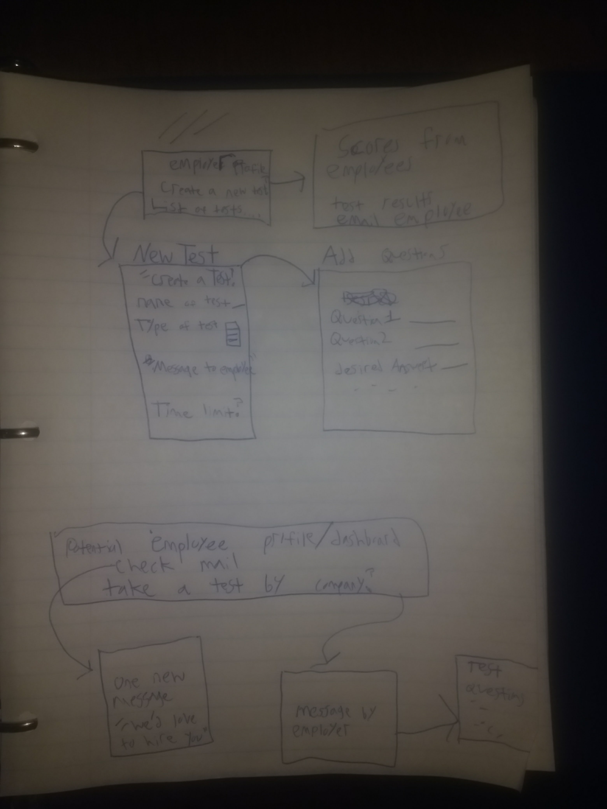

# ScreenerMVC

USER STORIES

1. As an employer of a company, I want to create a screening test for potential employees.

2. As an employer, I want to create questions and re-use questions for other created tests. 

3. As an employer, I want to see the results of all potential employees who took the test, and check their results for consistency, and personality.

4. As a potential new employee, I want to take the screening tests by available companies.

5. As an employer, I want send an email to employees who passed the test.

Wireframes

